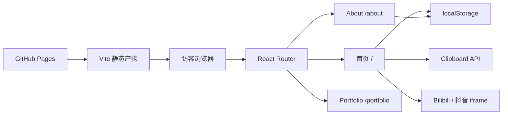
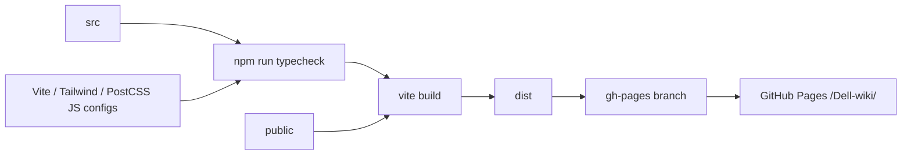

# Dell-wiki 前端架构

本文解释系统如何组织、关键技术决策为何成立，以及修改时应保持哪些模块边界。具体视觉参数和组件交互见 [UI 设计规范](ui-design.md)，构建与发布见 [开发与部署](development.md)。

## 1. 系统概览

Dell-wiki 是一个完全运行在浏览器中的静态 React 单页应用：



没有服务端 API、数据库、认证或运行时环境变量。页面内容编译进静态资源，外部依赖仅包括视频 iframe 和浏览器剪贴板能力。

## 2. 技术选择

| 层 | 方案 | 采用原因 |
|---|---|---|
| UI 运行时 | React 18 + TypeScript | 组件化组织交互页面，并在构建期检查类型 |
| 构建 | Vite 5 | 轻量开发服务器与适合静态站点的生产构建 |
| 路由 | React Router 6 | 保持 SPA 体验，同时表达独立页面边界 |
| 样式 | Tailwind CSS 3 + 全局 CSS 变量 | Tailwind 负责局部布局，CSS 变量维持跨页面主题一致性 |
| 动效 | Framer Motion + CSS keyframes + Canvas | 分别处理拖拽/组件动效、轻量状态动画和首页背景 |
| 持久化 | 浏览器 localStorage | 主题和演示点赞无需服务端即可跨刷新保存 |
| 部署 | GitHub Pages + gh-pages | 个人静态站点的低运维发布方式 |

项目没有采用现成 UI 组件库。窗口、按钮、图标和模态层均为本地组件，以便保持独特的像素视觉。

## 3. 路由层级

路由统一定义在 `src/App.tsx`：

```text
BrowserRouter (basename = import.meta.env.BASE_URL)
├─ /            HomePage
├─ /about       AboutPage
├─ /portfolio   PlaceholderPage
└─ *            Navigate → /
```

- `/` 与 `/about` 是当前正式页面。
- `/portfolio` 只保留导航目标和页面结构，不代表作品集已完成。
- 未知路由直接替换为首页，当前没有独立 404 UI。

### GitHub Pages 深链回跳

GitHub Pages 不原生支持 SPA fallback。当前流程是：

1. 直接请求子路由时，`public/404.html` 记录完整 pathname、query 和 hash 到 `sessionStorage`。
2. 404 页面跳回站点根。
3. `src/main.tsx` 在 React 挂载前取出记录并调用 `history.replaceState` 恢复原 URL。
4. `BrowserRouter` 使用 `import.meta.env.BASE_URL` 的 `/Dell-wiki/` basename 解析页面。

修改路由、Vite base 或部署位置时，这四步必须一起验证。

## 4. 模块边界

### 页面层：`src/pages/`

- `HomePage.tsx`：组合首页组件，并拥有 Toast、打开的视频、点赞数和 Canvas 背景生命周期。
- `AboutPage.tsx`：组合 About 分区；当前也包含该页面专用的数据和内部组件。
- `PlaceholderPage.tsx`：为未完成路由提供可返回首页的通用占位页。

页面层可以编排布局和页面级状态，但通用交互应优先下沉到 `components/` 或 `hooks/`。

### 组件层：`src/components/`

- 导航与内容窗格：`HelloPanel`、`GeneralPanel`、`VideoPanel`。
- 操作控件：`ThemeToggle`、`LikeButton`、`EmailButton`。
- 浮层与反馈：`VideoModal`、`NotificationToast`。
- 视觉基础：`PixelIcons.tsx`。

现有组件主要服务首页。只有在跨页面确实复用时才抽象公共组件，避免为了形式统一提前制造复杂 API。

### 数据层：`src/data/`

`homepage.ts` 保存首页邮箱、导航项和视频作品元数据。新增首页作品应从这里进入，而不是在 JSX 中重复硬编码。

About 的履历数据目前仍与 `AboutPage.tsx` 同文件。这是现状，不是长期强制边界；当内容编辑频率或复用需求增加时，可再迁到 `src/data/about.ts`。

### Hook 层：`src/hooks/`

- `useLocalStorageState`：对 React state 和 JSON localStorage 的轻量同步。
- `useTheme`：基于本地持久化切换 light/dark，并更新根节点主题标记和自定义光标变量。

不要为当前规模引入全局状态库。只有出现跨多路由、复杂派生或服务端同步状态时再重新评估。

### 样式与资源

- `src/styles/globals.css` 是主题 token、全局表面、光标、动画和背景纹理的权威实现。
- Tailwind class 负责组件内部布局、断点和少量一次性颜色。`tailwind.config.js` 是唯一配置来源；六个 `palette-*` 主视觉色映射到同名 CSS 变量并跨主题固定，主题基础色仍由 `:root[data-theme='dark']` 覆盖。
- `public/` 保存无需 import 的静态资源；引用时必须拼接 `import.meta.env.BASE_URL`。
- 根目录 `dotted.otf` 由 CSS 通过相对路径导入，构建时交给 Vite 生成带 hash 的字体资源。

## 5. 状态与数据流

| 状态 | 所在位置 | 持久化 | 说明 |
|---|---|---|---|
| 主题 | `useTheme` | `dell-wiki-theme` | light/dark，跨页面共享同一 key |
| 点赞数 | `HomePage` + hook | `dell-wiki-like-count` | 初始 4504，仅为本机演示值 |
| 是否已点赞 | `LikeButton` | 否 | 只控制当前会话图标，不限制重复点赞 |
| 当前视频 | `HomePage` | 否 | 用作品 id 决定模态层内容 |
| Toast | `HomePage` | 否 | 2.2 秒后清空 |
| About 动画阶段 | 页面内部组件 | 否 | 由 timer 与 IntersectionObserver 推进 |

状态保持在最接近使用点的位置。当前没有 Context 或外部 store。

## 6. 主题架构

1. `main.tsx` 在首次 render 前读取主题 key，先应用根节点主题与光标，减少初始错误光标。
2. `useTheme` 使用 `useLocalStorageState` 管理主题。
3. `applyThemeCursor` 写入 `document.documentElement.dataset.theme` 和光标 CSS 变量。
4. `globals.css` 的 `:root` 与 `:root[data-theme='dark']` 切换语义 token。
5. 组件消费 `var(--text)`、`var(--btn-bg)`、`var(--video-shell-bg)` 等变量，而不是自行维护整套暗色 class。

新组件应使用语义 token；仅有单一艺术含义的强调色可以保留局部色值。

## 7. 响应式策略

项目使用 Tailwind 默认断点：

- 默认：移动端单列文档流。
- `sm`（640px）：About BIO 开始横向排列。
- `md`（768px）：首页切换为固定画布式绝对定位；视频宽 400px，Hello 宽 500px；About 显示顶部锚点导航并增大间距。
- `lg`（1024px）：About 使用 5 列或 2 列网格组织内容。

策略是“移动端可读文档流、桌面端互动桌面”。桌面布局强调空间关系，移动端强调顺序阅读，不要求复刻窗格散落位置。

## 8. 无障碍与国际化

当前已有：

- 多数图标按钮具有 `aria-label`。
- 点赞按钮有 `aria-pressed`。
- 视频封面和头像有替代文本。
- 使用原生 `button` 和 `a` 作为交互元素。
- 页面 HTML 语言为 `zh-CN`。

当前尚未形成完整方案：

- 视频模态层没有焦点圈定、Esc 关闭或打开后焦点管理。
- About 动效没有 `prefers-reduced-motion` 降级。
- 若干 hover 交互缺少清晰的 `focus-visible` 对等反馈。
- 内容中英混排且全部硬编码，没有国际化资源层。

在现阶段不引入 i18n 框架；如果需要英文版本，应先设计内容模型和路由策略。无障碍改进应优先补原生键盘路径和 reduced-motion，而不是先引入大型依赖。

## 9. 部署架构



`npm run deploy` 通过 `predeploy` 自动执行构建。`dist/` 是派生产物，不是设计或内容的事实源。

## 10. 架构约束与已知债务

- `node_modules/`、`dist/`、`dist-ssr/` 和 `*.tsbuildinfo` 是依赖或派生产物，不纳入项目版本控制；`package-lock.json` 继续跟踪以固定依赖解析。
- Vite 与 Tailwind 均以根目录 `.js` 文件为唯一配置来源；`tsconfig.node.json` 通过 `allowJs`、`checkJs` 和 `noEmit` 检查这些配置，构建不再生成平行的 `.ts` 或 `.d.ts` 副本。
- About 单文件较大且同时包含数据、动画组件与页面布局。当前可工作；只有在继续增长或进入频繁内容编辑阶段时再拆分。
- 视频播放依赖第三方嵌入策略，没有应用侧错误恢复。
- Canvas 与大量定时动画缺少统一的 reduced-motion 控制。

这些是明确的演进方向，不表示普通页面任务可以顺手重构。
