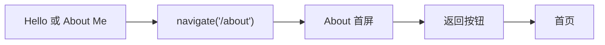
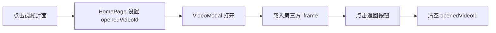

# Dell-wiki UI 设计规范

本文是 Dell-wiki 详细视觉与交互方案的唯一规范来源。内容以 2026-07-31 的当前源码为事实源；尚未实现的设计方向会明确标为缺口或未来规范。

架构级边界见 [前端架构](architecture.md)，开发和部署方式见 [开发与部署](development.md)。

## 1. 页面目标与用户场景

### 产品目标

- 在第一屏建立鲜明、可记忆的个人视觉身份。
- 让访客在最短路径内进入个人介绍或播放代表作品。
- 用游戏角色档案和复古桌面隐喻，把履历信息变得轻松但仍可读。
- 在桌面端提供探索感，在移动端优先保证顺序阅读。

### 核心用户场景

1. 招聘方或合作方快速判断 Dell 的方向、技能与代表作品。
2. 普通访客从首页进入 About，了解教育、经历与奖项。
3. 访客直接点击封面播放外部视频作品。
4. 访客复制邮箱进行联系。
5. 回访者保持自己选择的浅色或深色主题。

### 信息优先级

1. 身份与定位：Dell、数字媒体艺术、创作方向。
2. 代表作品：三项视频封面、标题与创作者信息。
3. 能力与履历：技能、教育、工作经历、奖项。
4. 联系与轻互动：邮箱、点赞、主题切换。
5. 尚未完成的完整 Portfolio 页面。

## 2. 设计性格

关键词：

- 淡彩色像素风
- Lo-Fi 数字感
- 复古桌面窗口
- 游戏角色档案
- 轻量玻璃拟态
- 友好、活泼、非商务模板化

视觉冲突的处理原则是“像素负责性格，玻璃和留白负责现代感”。不要把所有元素都做成高密度 8-bit UI，也不要用通用 SaaS 卡片抹掉像素语言。

## 3. 页面布局

### 首页桌面端

桌面断点从 768px 开始。主舞台最大宽度 1440px，高度锁定为一屏并隐藏纵向溢出；俄罗斯方块 Canvas 固定铺满视口。

```text
┌──────────────────────────────────────────────────────────────┐
│                                              ( Theme )       │
│                                      ┌── Video 2 ─────────┐  │
│  ┌─ GENERAL ─────┐                  │                     │  │
│  │ Dell-wiki     │   ┌── HELLO ──┐ │       Cover         │  │
│  │ About Me      │   │  Avatar    │ └─────────────────────┘  │
│  │ My Portfolio  │   │ Hello...   │                          │
│  └───────────────┘   └────────────┘                          │
│                       (Like) (Email)                          │
│  ┌── Video 1 ─────────┐              ┌── Video 3 ─────────┐  │
│  │       Cover        │              │       Cover        │  │
│  └────────────────────┘              └─────────────────────┘  │
└──────────────────────────────────────────────────────────────┘
```

实际锚点：

- General：top 22%，left 32px。
- Hello：视口中央，宽 500px。
- Video 1：top 60%，left 8%。
- Video 2：top 15%，right 10%。
- Video 3：top 55%，right 15%。
- Theme：top/right 32px。

视频窗格宽 400px。布局允许视觉重叠，但 Hello 与主要操作应保持第一优先级。

### 首页移动端

移动端使用普通文档流，水平 padding 16px，顶部留 96px：

```text
( Theme )
┌─ GENERAL ────────────┐
└──────────────────────┘
┌─ HELLO ──────────────┐
└──────────────────────┘
       (Like) (Email)
┌─ Video 1 ────────────┐
└──────────────────────┘
┌─ Video 2 ────────────┐
└──────────────────────┘
┌─ Video 3 ────────────┐
└──────────────────────┘
```

移动端不追求桌面散落构图。视频保持 16:9，窗格占满容器宽度；顶栏拖拽关闭，触摸手势保留给页面滚动。

### About 桌面端

内容最大宽度 1024px，顶部导航内容最大宽度 1152px；主内容 top padding 112px。

```text
┌──────────────────────────────────────────────────────────────┐
│ (Back)   [BIO][STATS][SKILLS][ACADEMY][MISSION][TROPHY] (☾) │
├──────────────────────────────────────────────────────────────┤
│ ┌─ BIO ─────────────┐ ┌─ STATS ────────────────────────────┐ │
│ │ Avatar + Profile  │ │ Progress bars                     │ │
│ └───────────────────┘ └────────────────────────────────────┘ │
│ ┌─ SKILLS ─────────────────────────────────────────────────┐ │
│ │ AIGC              现场执行              影视后期          │ │
│ └──────────────────────────────────────────────────────────┘ │
│ ┌─ ACADEMY ────────────────────────────────────────────────┐ │
│ └──────────────────────────────────────────────────────────┘ │
│ ┌─ MISSION ──────────┐ ┌─ TROPHY ─────────────────────────┐ │
│ └────────────────────┘ └───────────────────────────────────┘ │
└──────────────────────────────────────────────────────────────┘
```

About 默认单列；1024px 起 BIO/STATS 使用 2/3 列比例，MISSION/TROPHY 使用等宽双列。顶部中间锚点在小于 768px 时隐藏。

## 4. 主视觉色板

颜色系统分成两层：

1. **马卡龙主视觉色**：负责品牌识别和页面分区，在浅色与深色模式下保持相同色相和色值。
2. **主题基础色**：负责背景、面板、文字、边框和控件。浅色与深色模式使用不同组合，以平衡可读性和视觉氛围。

新增页面时先确定需要的是“品牌强调”还是“主题基础”。不要为了让颜色更显眼就直接修改主视觉色色值。

### 4.1 跨主题统一的马卡龙主视觉色

| 名称 | 固定色值 | 推荐角色 | 常用透明版本 |
|---|---|---|---|
| 薄荷青 | `#BEEFE6` | BIO、身份、友好入口、轻柔正向信息 | `rgba(190,239,230,.82)` |
| 雾紫 | `#C5B9FB` | SKILLS、创意、AIGC、次级强调 | `rgba(197,185,251,.82)` |
| 奶油黄 | `#F6D68F` | ACADEMY、奖项、温和提示 | `rgba(246,214,143,.82)` |
| 浅灰白 | `#F0F0F2` | 中性窗口、低强调区域、Canvas 方块 | 根据所在表面调整透明度 |
| 珊瑚橙 | `#FD9978` | STATS、About 导航、暖色作品窗口 | `rgba(253,153,120,.66)` |
| 马卡龙蓝色 | `#8FB6D6` | MISSION、技术/影视能力、冷色窗口 | `rgba(143,182,214,.66)` |

这六种颜色在两个主题中表达同一身份。深色模式可以改变透明度、文字色、边框或周围基础色来提高对比，但不应把薄荷青替换成蓝色、把雾紫替换成另一种紫色。

浅色马卡龙色主要作为**背景、窗口顶栏、进度块和装饰**，不直接承担小字号正文。放在这些色块上的文字优先使用 `#1A1A1A` 或黑色 70%–80%；不要因为进入深色模式就把色块内文字一律改成白色。

### 4.2 浅色模式基础色

| 名称 | 色值 | 推荐角色 | 调整方向 |
|---|---|---|---|
| 雾灰背景 | `#F8F9FA` | 页面背景、Canvas 底色 | 需要更安静时降低网格透明度，不先改背景色 |
| 面板白 | `rgba(255,255,255,.96)` | 高可读主面板 | 需要更通透时可降到约 .82–.90 |
| 强面板白 | `rgba(255,255,255,.98)` | 头像底、Tooltip、关键浮层 | 保持接近不透明以承载文字 |
| 纯白 | `#FFFFFF` | 圆形按钮、Toast | 与低透明黑边框配合 |
| 墨黑 | `#1A1A1A` | 主标题、正文 | 不使用纯黑粗边框 |
| 灰紫 | `#5C5C6A` | 次要说明、时间、元信息 | 仅用于非关键文字 |
| 轻边框 | `rgba(0,0,0,.06)` | 窗口、按钮边界 | hover 不通过加深边框，主要增加阴影 |
| 细网格 | `rgba(0,0,0,.02)` | 4px 背景纹理 | 保持接近不可见，不能抢正文 |

### 4.3 深色模式基础色与青绿色阶

深色模式围绕青灰/灰绿建立从深到浅的层级：

`#394F57` → `#446668` → `#749593` → `#B9CBC9` → `#BEEFE6`

| 名称 | 色值 | 明度层级 | 当前/推荐用途 | 文字与图标搭配 |
|---|---|---:|---|---|
| 深海青灰 | `#394F57` | 最深 | 页面背景、像素点底色 | 白色主文字；`#B9CBC9` 次要文字 |
| 墨绿灰 | `#446668` | 深 | 按钮、Toast、模态控制 | 白色文字/图标 |
| 鼠尾草青 | `#749593` | 中 | Tab 图标底、视频窗口辅助顶栏 | 白色图标；不承载小号长正文 |
| 雾绿灰 | `#B9CBC9` | 浅 | 弱化文字、Hello 文字、模态标题、网格基色 | 放在 `#394F57` 或更深表面 |
| 薄荷青 | `#BEEFE6` | 最浅 | 跨主题品牌强调、身份与正向信息 | 深色文字，不作为大面积页面底色 |

深色模式另外使用以下中性表面：

| 角色 | 色值 | 用途 |
|---|---|---|
| 深色面板 | `rgba(35,38,49,.96)` | 高可读窗口 |
| 深色强面板 | `rgba(28,31,42,.98)` | 关键浮层和头像底 |
| 轻玻璃层 | `rgba(255,255,255,.08)` | 视频/卡片内容区 |
| 主文字 | `#FFFFFF` | 标题与关键正文 |
| 边框 | `rgba(255,255,255,.12)` | 深色表面边界 |
| 网格 | `rgba(185,203,201,.15)` | 深色背景纹理 |

当某处细节“太深”或“太浅”时，Codex 应按以下顺序调整：

1. 先从上面的青绿色阶选择相邻层级。
2. 如果色相正确但视觉重量不合适，优先调整透明度，不立即创造新十六进制色。
3. 强调色表面可在实色、.82 和 .66 三档之间选择；正文表面应维持更高不透明度。
4. 仍不能满足对比时，可以小幅调整明度，但必须保持原色相，并把反复使用的新值补回本表。

### 4.4 辅助与状态色

| 名称 | 色值 | 限定用途 |
|---|---|---|
| 亮黄色 | `#FEC837` | 比奶油黄更强的黄色高亮，谨慎使用 |
| 低饱和薄荷 | `#BEE6DD` | 品牌圆标等小面积细节；不替代主色板的薄荷青 |
| 爱心粉 | `#FF6B8B` | Like 与像素粒子，不表示错误 |
| 在线绿 | `#4ADE80` | 在线/活跃状态点 |

错误状态尚无正式 token。未来应新增低饱和错误红及其浅/深主题表面，不能复用爱心粉冒充错误。

### 4.5 代码 token 命名

六个主视觉色只在 `:root` 定义一次，深色主题直接继承，确保不会因主题覆盖改变品牌色。

| 颜色 | CSS 变量 | Tailwind 名称 |
|---|---|---|
| 薄荷青 | `--palette-mint` | `palette-mint` |
| 雾紫 | `--palette-lavender` | `palette-lavender` |
| 奶油黄 | `--palette-cream-yellow` | `palette-cream-yellow` |
| 浅灰白 | `--palette-soft-grey` | `palette-soft-grey` |
| 珊瑚橙 | `--palette-coral` | `palette-coral` |
| 马卡龙蓝色 | `--palette-blue` | `palette-blue` |
| 亮黄色辅助色 | `--highlight-yellow` | `highlight-yellow` |

现有品牌圆标使用更低饱和的细节色 `#BEE6DD`，代码 token 为 `--detail-muted-mint`。它不是“薄荷青”主色的别名，不应合并到 `--palette-mint`，否则会造成现有视觉漂移。

组件内使用颜色语义名，不使用与真实色值不符的历史名称。视频窗口的 `chrome` 值为：

| chrome 值 | 实际颜色 |
|---|---|
| `coral` | 珊瑚橙 `rgba(253,153,120,.66)` |
| `cream` | 奶油黄 `rgba(246,214,143,.82)` |
| `sage` | 鼠尾草青 `rgba(116,149,147,.66)` |

旧的 `--accent-*`、`--macaron-*`、`bg-macaron-*` 以及 `purple/yellow/grey` chrome 名称已经退役。新代码不得重新引入这些含糊或错误的颜色名。

### 4.6 色彩组合规则

- 同一窗口顶栏只使用一个主视觉色，正文区域回到当前主题的中性玻璃表面。
- 一屏同时出现的高饱和强调色不超过三种；其他区域可使用同色透明版本或中性表面。
- 主视觉色保持跨主题一致；主题差异通过背景、表面、文字、边框和透明度建立。
- 浅黄、薄荷青、浅灰白不作为小字号正文色。
- 深色背景上的次要文字优先使用雾绿灰，不要随意再造相近灰绿色。
- 颜色选择顺序是：语义角色 → 主题基础层级 → 对比度 → 美观微调，而不是先凭视觉挑一个近似色。

## 5. 字体与文字层级

### 字体

- 主字体：`DottedPixel`，来源 `dotted.otf`。
- 后备：`ui-monospace, monospace`。
- `-webkit-font-smoothing: none` 保持像素边缘。
- 图标 SVG 使用 `shapeRendering="crispEdges"` 或 `image-rendering: pixelated`。

### 层级

| 层级 | 当前尺寸 | 用途 |
|---|---:|---|
| Hero | 36px / `text-4xl` | 首页问候 |
| Page/Panel title | 24px / `text-2xl` | General 品牌标题 |
| Window title/action | 20px / `text-xl` | 模态标题、按钮、窗口信息 |
| Emphasis | 18px / `text-lg` | 导航项、重要字段 |
| Body | 16px | 正文和 About 内容 |
| Meta | 14px / `text-sm` | 描述、时间、标签 |
| Caption | 12px / `text-xs` | 窗口顶栏、状态、补充说明 |

中英混排时优先保证中文可读性。逐字动画不应改变最终文本的行高或容器尺寸。

## 6. 空间与表面 token

### 基础网格与间距

以 4px 为最小视觉网格，常用间距：

| Token | 值 | 用途 |
|---|---:|---|
| 1x | 4px | 像素细节、粒子、紧凑 gap |
| 2x | 8px | 图标内部、顶栏点间距 |
| 3x | 12px | 控件 gap、视频内边距 |
| 4x | 16px | 页面移动端边距、卡片间距 |
| 5x | 20px | 小窗格内容 padding |
| 6x | 24px | General padding、按钮组间距 |
| 7x | 28px | About 桌面窗口内容 padding |
| 8x | 32px | 页面区块间距、固定控件边距 |
| 10x | 40px | Hello 内容 padding |
| 12x | 48px | About 桌面区块纵向间距 |

### 圆角

- 视频画面内框：10px。
- 窗口顶栏：顶部 12px。
- 标准窗口/Toast/面板：16px。
- 标签和状态块：6–12px。
- 主操作按钮、头像、Chip：9999px / full。

### 阴影

浅色默认：

```css
0 4px 6px -1px rgba(0, 0, 0, 0.05)
```

浅色 hover：

```css
0 20px 25px -5px rgba(0, 0, 0, 0.1)
```

深色使用两层阴影，组合低透明紫灰高光与黑色投影。统一消费 `--surface-shadow` / `--surface-hover-shadow`，不要在新组件中复制近似值。

### 玻璃表面

- 主窗口背景可透明，让 Canvas 和网格透出。
- 内容层使用 `--panel`、`--panel-strong` 或 `--video-shell-bg` 保证可读性。
- 常规 blur：14px。
- 模态遮罩 blur：10px + `rgba(14,16,24,.42)`。
- 边框固定为 1px 低透明线，不使用厚黑描边。

## 7. 图标、光标与图片资源

- 全局光标：`public/cursor-minimal.svg` 与 `public/cursor-minimal-dark.svg`。
- 导航图标：`public/avatar-square.svg`、`public/briefcase.svg`。
- Like 图标：红色 outline/solid 两态 SVG。
- 窗口顶栏圆点使用镂空像素环，中心直接透出顶栏底色，避免半透明主色重复叠加后产生色差。
- 代码内图标：`src/components/PixelIcons.tsx` 的 crisp SVG。
- 头像：`public/image/avatar/dinosaur.png`。
- 作品封面：`public/image/covers/`。

所有 public 资源在代码中必须经过 `BASE_URL`。本项目不维护独立的可视化色板文件；颜色方案直接维护在本文第四部分。

## 8. 组件状态与行为

表中“缺口”代表当前代码没有相应状态，不能在文档中假装已经实现。

| 组件 | 默认 | Hover/Focus | Active/成功 | Loading/空 | Error/禁用 | 移动端 |
|---|---|---|---|---|---|---|
| ThemeToggle | 圆形按钮，浅色月亮/深色太阳 | hover 上移 6px并加深阴影；缺少统一 focus-visible | 点击立即切主题并持久化 | 不适用 | 无禁用态 | 固定右上，保持 48px |
| General Tab | 图标、文字、箭头 | hover 变强调色白字；键盘可聚焦但焦点样式不够明确 | 当前 pathname 显示 active 色 | 无数据状态 | 无禁用态 | 面板全宽，Tab 纵排 |
| HelloPanel | 头像 + 问候 | 整窗上浮，头像放大；Tooltip 仅 hover | 点击进入 About | 图片使用 lazy load，无骨架 | 图片失败无替代 UI | 全宽，内容居中 |
| LikeButton | outline heart + 本地点赞数 | 上浮、阴影加深 | 点击变实心红心、计数 +1、粒子喷发 | 不适用 | 可无限重复，无禁用/提交失败概念 | 胶囊按钮，随按钮组换行 |
| EmailButton | 邮件图标 + Email | 上浮、阴影加深 | Clipboard 成功或 fallback 后显示 Toast | 不适用 | fallback 最终失败也没有错误提示 | 与 Like 并排或换行 |
| VideoPanel | 顶栏 + 封面 + 播放符号 | 整窗上浮，Tooltip 渐显 | 桌面端顶栏拖拽；封面打开模态层 | 图片 lazy load；缺封面时显示文字 fallback | 图片加载失败无 UI；无禁用态 | 单列全宽，关闭拖拽并允许正常滚动 |
| VideoModal | 遮罩 + 顶栏 + iframe | 返回按钮 hover | 点击返回关闭 | iframe 无 loading UI | 无错误 UI、Esc、遮罩关闭或焦点圈定 | 四周 16px，保持 16:9 |
| Toast | 右下角短消息 | 不交互 | 2.2 秒自动消失 | 不适用 | 无错误变体 | 最大宽 280px |
| About Window | 彩色顶栏 + 内容 | 窗口上浮 | IntersectionObserver 触发一次动画 | 打字/进度是叙事动画，不是数据加载 | 无 reduced-motion 方案 | 单列，顶部锚点隐藏 |
| Placeholder | 居中玻璃窗 | hover 上浮 | Back Home | 可视为空状态 | 无错误/禁用 | 自适应宽度 |

### 未来状态规范

- Loading：保留最终组件尺寸，使用低对比像素块或静态占位；不要用连续旋转的写实 spinner。
- Empty：使用标准像素窗口说明“尚无内容”，同时给出一个明确下一步；Portfolio 占位页是现有范例。
- Error：在出错组件内部显示简短原因和重试/返回，不只依赖 Toast。
- Disabled：保留轮廓，透明度约 50%，取消上浮和粒子，不改变布局。
- Focus：所有 hover 可操作项都要有 `focus-visible` 对等反馈；建议用 2px 雾紫或薄荷青外环。
- Reduced motion：停止 Canvas、拖拽装饰动画和逐字延迟，直接显示最终内容。

## 9. 动效规则

| 动效 | 当前参数 | 目的 |
|---|---|---|
| 表面 hover | 300ms，上移 6px | 提示可交互并增强层次 |
| Tab 色彩 | 200ms | 快速导航反馈 |
| Like 粒子 | 650ms ease-out | 提供情感奖励 |
| About pop-in | 600ms，带轻微弹性 | 游戏界面解锁感 |
| 打字机 | 每字符约 35–75ms | 终端叙事节奏 |
| 进度条 | 每格 60ms | 属性加载感 |
| Canvas 方块 | requestAnimationFrame | 维持首页动态氛围 |

2026-07-31 为解决 Chromium 浏览器中 Canvas 背景动画经过毛玻璃窗格时出现的闪烁，General 和 Video 窗格尝试沿用 Hello 的层级结构：绝对定位和 `z-index` 由外层布局容器承担，应用 `backdrop-filter` 的内层保持 `position: relative`、`z-index: auto` 和 `overflow: hidden`；视频 Tooltip 放在毛玻璃裁切层之外、布局容器之内。该调整已经保留在源码中，但仍未消除闪烁，问题暂时搁置。后续继续排查时应把当前实现视为一次未完全奏效的尝试，不能把它记录成已解决方案。

最初设想的“Hello → General → 三个作品顺时针依次弹出”当前没有实现。新增入场动画前必须先加入 reduced-motion 降级，且不能阻塞访客点击主要入口。

拖拽只在 `md`（768px）及以上启用，并且只允许从视频顶栏开始；移动端关闭拖拽、移除拖拽提示并恢复正常触摸滚动。`dragMomentum=false` 和 `dragElastic=0` 保持桌面窗口的直接操控感。当前拖拽中临时提高 z-index，但没有点击后持久置顶。

## 10. 关键交互流程

### 首页进入 About



### 播放作品



### 复制邮箱

优先 Clipboard API；失败时退回隐藏 textarea。成功反馈使用右下 Toast。未来若 fallback 也失败，应显示错误态并保留可手动选择的邮箱文本。

## 11. 响应式与内容规则

- 320px 是 body 最小宽度。
- 触控目标保持至少 44×44px；当前主要圆形按钮为 48px。
- 小屏不显示 About 中间锚点导航，用户按文档流滚动。
- 视频标题/创作者 Tooltip 使用 truncate 防止溢出；正文履历允许自然换行。
- 不为追求桌面构图而在移动端使用绝对定位。
- 新增长文本要分别在 320px、768px 和 1024px 附近检查换行。

## 12. 设计取舍与已知缺口

- 使用本地组件而非通用 UI 库，是为了保留像素窗口的辨识度；代价是状态和无障碍能力需要自行补齐。
- 使用 CSS 变量做主题，而不是复制两套 Tailwind class，可降低跨页面视觉漂移。
- 使用纯前端 localStorage 保持零后端部署；代价是点赞不能代表真实用户数据。
- 桌面绝对定位提供作品散落感；移动端回到文档流以避免小屏碰撞。
- iframe 减少仓库体积；代价是播放可用性受第三方平台控制。
- About 的打字与滚动动画强化角色档案叙事；当前缺少 reduced-motion 和完整键盘体验。
- 首页当前没有设计中的顺时针入场、点击持久置顶和“原窗格平滑放大”转场。

新增页面时先确定信息层级和主强调色，再复用窗口、Chip、按钮与主题机制；任何新数值都应先与当前源码和本文 token 核对。
